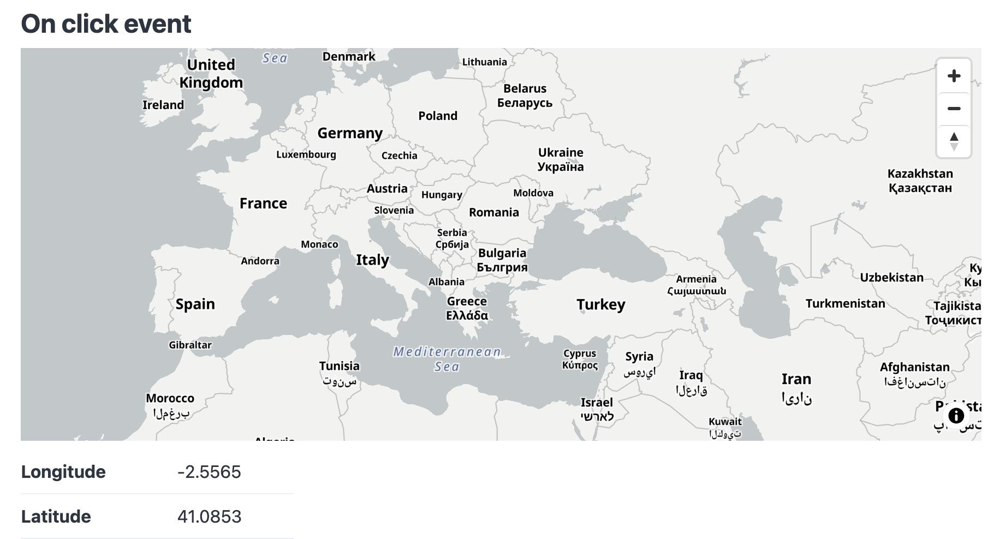

# Cartoj

[](https://github.com/perrygeo/cartoj/actions/workflows/test.yml)
Clojurescript [reagant](https://reagent-project.github.io/) components for interactive maps,
built on [react-map-gl](https://visgl.github.io/react-map-gl/) and [MapLibre](https://maplibre.org/projects/gl-js/).
## Status

**Alpha** — API is not stable, not yet published to Clojars.


## Documentation


[https://perrygeo.github.io/cartoj/](https://perrygeo.github.io/cartoj/)


## Installation

> Not yet on Clojars. The deps coordinate below is the intended shape

Add to `deps.edn`:

```clojure
{:deps {io.github.perrygeo/cartoj {:mvn/version "0.1.0"}}}
```

Or in `shadow-cljs.edn`:

```clojure
:dependencies [[io.github.perrygeo/cartoj "0.1.0"]]
```

## Usage


```clojure
(ns example
  (:require [cartoj.controls :as ctrl]
            [cartoj.core :as cartoj]
            [cartoj.interop :as interop]
            [reagent.core :as r]))

(defn on-click-example
  "A Form-2 style component, tracks map click coordinates in a reagant atom."
  []
  (let [last-point    (r/atom nil)
        click-handler (fn [^js e]
                        (reset! last-point (interop/coords-from-evt e)))]
    (fn []
      [:section
       [:h2 "On click event"]
       [cartoj/interactive-map {:initial-view-state {:latitude 16 :zoom 1}
                                :map-style          "https://tiles.openfreemap.org/styles/positron"
                                :on-click           click-handler}
        [ctrl/navigation-control {:position "top-right"}]]
       [:table {:style {:width "250px"}}
        [:tbody
         [:tr
          [:th "Longitude"]
          [:td (if-let [lng (:longitude @last-point)]
                 (.toFixed lng 4) "-")]]
         [:tr
          [:th "Latitude"]
          [:td (if-let [lat (:latitude @last-point)]
                 (.toFixed lat 4) "-")]]]]])))
```




See the [live demo](https://perrygeo.github.io/cartoj/03-examples.html) for more examples.
